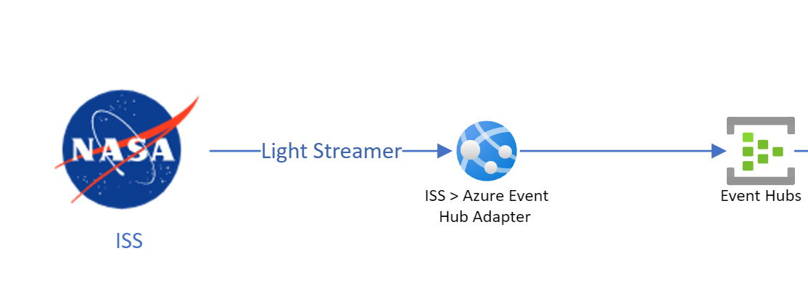

# ISS Azure Data Adapter
A fun side project, This repository contains a dotnet app service which listens to data from the ISS lightstreamer service and sends json messages to a specified Azure Eventhub or Azure IoT Hub.

## Architecture

The architecture is as follows:



## App Settings

The Following settings are required on top of the standard azure app service settings to run the app service.

These settings are defined in the appsettings.json file, or when running as an azure app service in the "configuration" settings section.

| Setting Name | Type | Description |
| ------------ | ---- | ----------- |
| UPSTREAM_CONNECTION_STRING | string | The connection string to the upstream data source, this can be used instead of IOT_HUB_CONNECTION_STRING or EVENT_HUB_CONNECTION string. |
| UPSTREAM_MODE |string | The mode of the upstream data source, set this to IOT_HUB to send to an IOT_HUB |
| EVENT_HUB_CONNECTION_STRING | string | The connection string to the event hub. (obselete - use 'UPSTREAM_CONNECTION_STRING') |
| IOT_HUB_CONNECTION_STRING | string | The connection string to the Iot hub. (obselete - use 'UPSTREAM_CONNECTION_STRING') |
| EVENT_HUB_NAME | string | The name of the event hub (when sending data to event hubs). |
| MAX_UPDATE_FREQUENCY | string | Property RequestedMaxFrequency represents the maximum update frequency to be requested to Lightstreamer Server for all the items in the Subscription. |

## Max Update Frequency

The value can be a decimal number, representing the maximum update frequency (expressed in updates per second) for each item in the Subscription; for instance, with a setting of 0.5, for each single item, no more than one update every 2
seconds will be received. If the string "unlimited" is supplied, then no frequency
limit is requested. 

## Json Payload

The schema of the payload for an ISS Telemetry Update is as follows:

```jsonschema

  "$schema": "http:json-schema.org/draft-04/schema#",
  "type": "object",
  "properties": {
    "Discipline": {
      "type": "string"
    },
    "MessageType": {
      "type": "string"
    },
    "Status": {
      "type": "string"
    },
    "Indicator": {
      "type": "string"
    },
    "Color": {
      "type": "string"
    },
    "TimeStamp": {
      "type": "string"
    },
    "Value": {
      "type": "string"
    },
    "CalibratedData": {
      "type": "string"
    },
    "PUI": {
      "type": "string"
    },
    "Public_PUI": {
      "type": "string"
    },
    "Description": {
      "type": "string"
    },
    "MIN": {
      "type": "string"
    },
    "MAX": {
      "type": "string"
    },
    "OPS_NOM": {
      "type": "string"
    },
    "ENG_NOM": {
      "type": "string"
    },
    "UNITS": {
      "type": "string"
    },
    "ENUM": {
      "type": "string"
    },
    "Format_Spec": {
      "type": "string"
    }
  },
  "required": [
    "Discipline",
    "MessageType",
    "Status",
    "Indicator",
    "Color",
    "TimeStamp",
    "Value",
    "CalibratedData",
    "PUI",
    "Public_PUI",
    "Description",
    "MIN",
    "MAX",
    "OPS_NOM",
    "ENG_NOM",
    "UNITS",
    "ENUM",
    "Format_Spec"
  ]
}

``` 